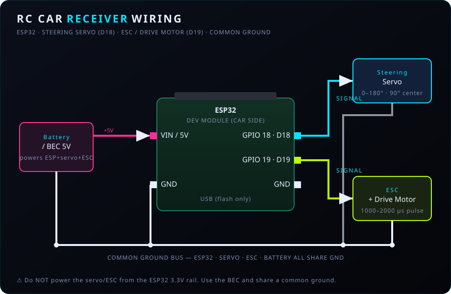
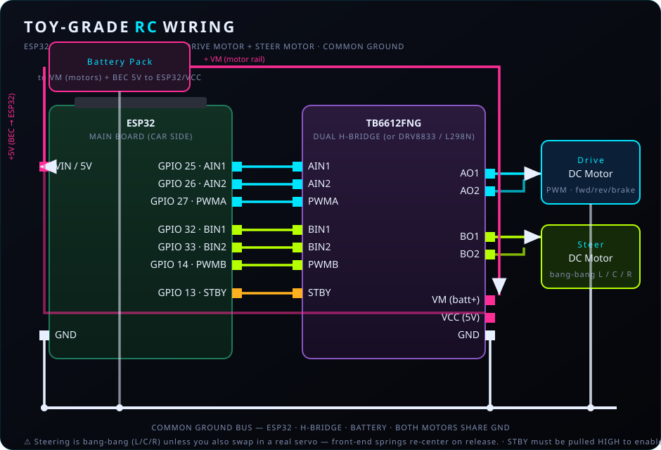

# 🏁 RC SIM Racing Arcade Lobby

A multi-cabinet, cross-platform **RC Sim Racing Arcade**. Any user sitting at a local sim rig (Chromebook or Windows PC) opens a single static web app, picks a car from a visual lobby grid, and drives it in real time with an FPV video feed and **&lt;20 ms** target control latency.

The whole control chain is browser → USB → radio → car:

```
┌─────────────────────────┐        USB Serial          ┌──────────────────────┐      ESP-NOW 2.4GHz      ┌──────────────────────┐
│   BROWSER (GitHub Pages) │  ───── 115200 baud ─────▶  │  MASTER TRANSMITTER  │  ──── DriveFrame ────▶  │    CAR RECEIVER(S)   │
│  Gamepad API  @ 50 Hz    │   CAR,.. / DRIVE,..\n      │   ENGLAB ESP32 DevKit│    servo/motor/seq      │  ESP32 in RC chassis │
│  Web Serial API          │  ◀──── ACK / telemetry ──  │   dynamic peer swap  │                          │  Servo D18 · ESC D19 │
│  MediaDevices (FPV)      │                            └──────────────────────┘                          └──────────────────────┘
└─────────────────────────┘
```

- **Frontend** — [`index.html`](index.html): a single, dependency-free HTML/CSS/JS file. No Node, npm, or build step. Installable as a PWA for offline/kiosk use.
- **Master transmitter** — [`electronics/master_transmitter/master_transmitter.ino`](electronics/master_transmitter/master_transmitter.ino): decodes serial packets, forwards them over ESP-NOW (swapping the target peer on the fly), and relays car telemetry back.
- **Car receiver** — [`electronics/car_receiver/car_receiver.ino`](electronics/car_receiver/car_receiver.ino): receives ESP-NOW frames, drives a steering servo (GPIO 18) and ESC/motor (GPIO 19), and reports battery + RSSI. A **toy-grade H-bridge variant** ([`car_receiver_toygrade`](electronics/car_receiver_toygrade/car_receiver_toygrade.ino)) covers non-servo chassis.

### ✨ Features

- **Visual lobby** — register/edit/delete cars in-app (MAC, icon, color, stats), Import/Export roster JSON.
- **Zero-latency control** — 50 Hz Gamepad polling, lean serial packets, ESP-NOW; live latency + packet-loss readout.
- **Drivetrain** — max-power cap, forward/reverse, 6-speed **manual gearbox** with a **10/20/40/60/80/100 %** per-gear curve, racing **RPM shift-lights**, and **simulated engine braking** (tunable strength).
- **Safety** — arming (throttle-at-rest required), on-screen + spacebar **E-STOP**, and browser-side failsafe (disarms on tab blur / controller drop).
- **Telemetry HUD** — gear, RPM, latency, packet loss, **battery voltage + low-battery warning**, RSSI.
- **Onboard FPV** — stream from a **$6 ESP32-CAM** or a **spare phone** (MJPEG) right into the viewport, with snapshot / record / remote-forward when the camera allows CORS.
- **Tuning** — steering trim / endpoint (EPA) / expo / invert, plus **per-car** power/transmission/trim/invert saved with each vehicle.
- **Extras** — keyboard driving fallback, WebAudio engine sound, FPV fullscreen + snapshot, lap timer, ESC calibration helper, and best-effort multi-cabinet "in use" presence.

---

## Table of Contents

1. [Chassis compatibility (hobby / toy / 2-in-1 ESC)](#-chassis-compatibility)
2. [Hardware you need](#-hardware-you-need)
3. [Software you need](#-software-you-need)
4. [Quick start (TL;DR)](#-quick-start-tldr)
5. [Part A — Deploy the web app to GitHub Pages](#part-a--deploy-the-web-app-to-github-pages)
6. [Part B — Set up the Arduino toolchain](#part-b--set-up-the-arduino-toolchain)
7. [Part C — Flash the Master Transmitter](#part-c--flash-the-master-transmitter)
8. [Part D — Flash the Car Receivers](#part-d--flash-the-car-receivers)
9. [Part E — Register each car's MAC in the lobby](#part-e--register-each-cars-mac-in-the-lobby)
10. [Part F — Wire the car hardware](#part-f--wire-the-car-hardware)
11. [Using the arcade](#-using-the-arcade)
12. [Serial protocol reference](#-serial-protocol-reference)
13. [Calibration & tuning](#-calibration--tuning)
14. [Troubleshooting](#-troubleshooting)
15. [Repository layout](#-repository-layout)

---

## 🚗 Chassis compatibility

**Does this work on toy-grade cars, or only hobby-grade?** Both — but they take different firmware and wiring.

| Chassis type | How it drives | Works with… | Notes |
|--------------|---------------|-------------|-------|
| **Hobby-grade** (proportional servo + ESC) | Servo PWM + ESC PWM | [`car_receiver.ino`](electronics/car_receiver/car_receiver.ino) | Plug-and-play: servo → D18, ESC → D19. |
| **Toy-grade** (two plain DC motors, no servo/ESC) | H-bridge PWM + bang-bang steer | [`car_receiver_toygrade.ino`](electronics/car_receiver_toygrade/car_receiver_toygrade.ino) | **Requires a hardware mod:** remove the toy RX board, add a dual H-bridge (TB6612 / DRV8833 / L298N). Steering is quantized to left/center/right; drive speed is PWM. The web app (gears, reverse, engine-braking) works unchanged. |

**What about "2-in-1" ESCs?** Depends what's combined:

| "2-in-1" means… | Compatible? | How |
|-----------------|-------------|-----|
| ESC + steering driver on one board, **two servo-PWM inputs** (common on crawlers) | ✅ Yes | D18 → steering input, D19 → throttle input, share ground. |
| ESC + **BEC** (built-in 5 V supply) | ✅ Yes | Standard — use the BEC to power the ESP32/servo. |
| ESC + **radio receiver** (all-in-one RTR RX-ESC) | ⚠️ Usually no | We replace the receiver, so there's nowhere to inject PWM unless the board exposes servo-PWM input pins. Use a standalone ESC instead. |
| Toy-grade all-in-one board | ❌ Not directly | Use the toy-grade H-bridge variant above. |

**Rule of thumb:** if the board accepts **standard servo-PWM signals**, it works. If it has an **integrated radio receiver** you can't feed, it doesn't.

### Wiring diagrams

<table>
<tr>
<td align="center" width="50%">
<b>Hobby-grade</b> — servo + ESC<br>
<sub>flash <code>car_receiver.ino</code></sub>
</td>
<td align="center" width="50%">
<b>Toy-grade</b> — dual H-bridge (TB6612 / DRV8833 / L298N)<br>
<sub>flash <code>car_receiver_toygrade.ino</code></sub>
</td>
</tr>
<tr>
<td></td>
<td></td>
</tr>
</table>

---

## 🔧 Hardware you need

### Desk side (one per cabinet)
| Item | Notes |
|------|-------|
| **ENGLAB ESP32 DevKit** (or any ESP32 DevKitC) | The master transmitter. Connects to the PC over USB. |
| **USB data cable** | Must be a **data** cable, not charge-only. |
| **Racing wheel / gamepad** | Anything the browser Gamepad API sees (Logitech G-series, Xbox pad, etc.). |
| **5.8 GHz FPV receiver + USB frame grabber** | A UVC video capture dongle the browser sees as a webcam (640×480 @ 60 fps). |
| **Chromebook or Windows PC** | Running Chrome or Edge. |

### Vehicle side (one per car)
| Item | Notes |
|------|-------|
| **ESP32 chip/board** | One per RC car. **Any WiFi ESP32 works** — classic ESP32, S2, S3, **C3/C6 "mini"** — so a mini board can drive a mini RC. The receiver auto-detects the chip and picks pins; see **[docs/PINOUTS.md](docs/PINOUTS.md)**. (ESP32-H2 has no WiFi and ESP8266 uses a different API — neither works.) |
| **Proportional steering servo** | Signal → steering pin (classic ESP32: **GPIO 18**; other boards: see [PINOUTS](docs/PINOUTS.md)). |
| **ESC + brushed/brushless motor** *(or a motor driver)* | Signal → ESC pin (classic ESP32: **GPIO 19**; other boards: see [PINOUTS](docs/PINOUTS.md)). |
| **RC car chassis** | Hobby-grade or a modified toy-grade car. |
| **Battery / BEC** | Powers the ESP32, servo, and ESC. **Do not** power the servo/ESC from the ESP32's 3.3 V rail. |
| **5.8 GHz FPV camera + video transmitter** | Streams video back to the desk-side frame grabber. |

> ⚠️ **Common ground is required.** The ESP32, servo, and ESC must share a ground reference, or PWM signals will be erratic.

---

## 💻 Software you need

- **Google Chrome or Microsoft Edge** (v89+). The Web Serial API is **not** available in Firefox or Safari. On a Chromebook this works out of the box.
- **Arduino IDE 2.x** (or Arduino CLI) to flash the ESP32s.
- **USB-to-UART driver** for your ESP32 board if it isn't detected: [CP210x](https://www.silabs.com/developers/usb-to-uart-bridge-vcp-drivers) or [CH340](https://www.wch-ic.com/downloads/CH341SER_ZIP.html).

---

## 🚀 Quick start (TL;DR)

1. Enable **GitHub Pages** on this repo (Settings → Pages → Deploy from `main` / root). Your app lives at `https://bmcmbuenviaje.github.io/conradrc/`.
2. Install the **ESP32 board package** and the **ESP32Servo** library in Arduino IDE.
3. Flash [`car_receiver.ino`](electronics/car_receiver/car_receiver.ino) to each car. Open the Serial Monitor at 115200 and copy the `READY,RECEIVER,<MAC>` line.
4. Paste those MACs into the `VEHICLES` array in [`index.html`](index.html), commit, and push.
5. Flash [`master_transmitter.ino`](electronics/master_transmitter/master_transmitter.ino) to the desk-side ESP32.
6. Open the Pages URL in Chrome → **Connect** the transmitter → bind your wheel → start the FPV feed → pick a car → drive.

---

## Part A — Deploy the web app to GitHub Pages

The frontend is fully static, so GitHub Pages serves it directly — no build step.

1. Go to the repo on GitHub → **Settings** → **Pages**.
2. Under **Build and deployment**, set **Source** = **Deploy from a branch**.
3. Choose **Branch: `main`**, **Folder: `/ (root)`**, then **Save**.
4. Wait ~1 minute. GitHub shows the live URL:
   ```
   https://bmcmbuenviaje.github.io/conradrc/
   ```
5. Open that URL in Chrome/Edge.

> 🔒 **Why HTTPS matters:** Web Serial, MediaDevices, and Gamepad APIs require a *secure context*. GitHub Pages is served over HTTPS, so all three work. `http://` or opening the file over a network share will silently disable Serial/camera access. (Local `file://` and `http://localhost` are also treated as secure if you want to test locally.)

### Testing locally (optional)
```bash
# From the repo root — any static server works because there is no build step:
python -m http.server 8080
# then open http://localhost:8080
```

---

## Part B — Set up the Arduino toolchain

Do this once on the machine you'll flash from.

1. Install **Arduino IDE 2.x** from <https://www.arduino.cc/en/software>.
2. **Add the ESP32 board manager URL:**
   - `File → Preferences → Additional boards manager URLs`, add:
     ```
     https://raw.githubusercontent.com/espressif/arduino-esp32/gh-pages/package_esp32_index.json
     ```
3. **Install the ESP32 core:**
   - `Tools → Board → Boards Manager` → search **esp32** → install **"esp32 by Espressif Systems"**.
   - ⚠️ **Install version 3.x** (e.g. 3.0.0+). This firmware uses the 3.x ESP-NOW callback signatures (`esp_now_recv_info_t`, `wifi_tx_info_t`). If you're pinned to core 2.x, see [Troubleshooting](#-troubleshooting).
4. **Install the servo library** (receiver only):
   - `Tools → Manage Libraries` → search **ESP32Servo** → install **"ESP32Servo" by Kevin Harrington / John K. Bennett**.

Board settings that work for most DevKitC / ENGLAB boards:
- **Board:** `ESP32 Dev Module`
- **Upload Speed:** `921600` (drop to `115200` if uploads fail)
- **Port:** the COM/tty port that appears when you plug the board in

---

## Part C — Flash the Master Transmitter

This is the ESP32 that stays plugged into the PC.

1. Open [`electronics/master_transmitter/master_transmitter.ino`](electronics/master_transmitter/master_transmitter.ino) in Arduino IDE.
2. Select the correct **Board** and **Port**.
3. Click **Upload** (→).
4. Open **Serial Monitor** at **115200 baud**. You should see:
   ```
   READY,MASTER,3C:61:05:XX:XX:XX
   ```
5. **Close the Serial Monitor.** Only one program can hold the port at a time — leave it closed so the browser can connect.

You do **not** need to hard-code the master's MAC anywhere; the browser talks to it over USB and it forwards to whichever car you select.

---

## Part D — Flash the Car Receivers

Repeat for **every** car.

1. Open [`electronics/car_receiver/car_receiver.ino`](electronics/car_receiver/car_receiver.ino).
2. Select **Board** and **Port** for the car's ESP32.
3. Click **Upload**.
4. Open **Serial Monitor** at **115200**. Record the printed MAC — you'll need it in the next step:
   ```
   READY,RECEIVER,AA:BB:CC:11:22:33
   ```
5. Label the car with its MAC (a piece of tape helps) and move to the next chassis.

The same `car_receiver.ino` is flashed to every car unchanged — cars are distinguished purely by their MAC address.

> **Toy-grade chassis?** Flash [`car_receiver_toygrade.ino`](electronics/car_receiver_toygrade/car_receiver_toygrade.ino) instead (needs a dual H-bridge — see [Chassis compatibility](#-chassis-compatibility)). It prints `READY,RECEIVER_TOY,<mac>`.

> ⚠️ **Reflash the master and all receivers together.** The `DriveFrame`/`TelemetryFrame` layouts must match on both ends — mixing old and new firmware will misread packets.

---

## Part E — Register each car's MAC in the lobby

The web app targets cars by MAC. There are two ways to do this — the in-app editor (fastest) or baking values into the source (permanent, shared to everyone).

### Option 1 — In the app (recommended)

The lobby has a built-in car manager, so you never have to touch the code:

- **＋ Register Car** — opens a form. Enter the vehicle name, an icon emoji, the **MAC** from the `READY,RECEIVER,...` line, an accent color, and the stat bars. Click **Save Vehicle** and a new car appears in the grid.
- **✎ (edit)** on any card — change its name, MAC, icon, color, or stats.
- **🗑 (delete)** on any card — remove it from the lobby.

Notes:
- The MAC field accepts colons, dashes, or plain hex (`AA:BB:CC:DD:EE:FF`, `aa-bb-cc-dd-ee-ff`, or `aabbccddeeff`) — it's normalized and validated for you, and duplicate MACs are rejected.
- Your roster is saved in that browser's **localStorage**, so it persists across reloads **on that machine/profile only**. Each cabinet keeps its own list.
- **⇩ Export** copies the roster as JSON to your clipboard; **⇧ Import** pastes one back in — with a **Merge** mode (add new MACs, update existing ones by MAC) or **Replace** mode (overwrite the whole lobby). This is how you sync one roster across cabinets: Export on the machine you set up, Import on the rest.

### Option 2 — Bake defaults into the source

To ship a default roster to *every* visitor of your GitHub Pages site, edit the `DEFAULT_VEHICLES` array near the top of the `<script>` block in [`index.html`](index.html):

```js
const DEFAULT_VEHICLES = [
  { id: 'rally', name: 'RALLY CAR',  sprite: '🏎️', mac: 'AA:BB:CC:11:22:33', accent: '#00e5ff', stats: { spd: 78, grip: 90, acc: 70 } },
  { id: 'buggy', name: 'DUNE BUGGY', sprite: '🚙', mac: 'AA:BB:CC:44:55:66', accent: '#b6ff00', stats: { spd: 65, grip: 72, acc: 95 } },
  { id: 'drift', name: 'DRIFT KING', sprite: '🚗', mac: 'AA:BB:CC:77:88:99', accent: '#ff2e97', stats: { spd: 88, grip: 55, acc: 82 } },
];
```

- Replace each `mac:` with the real `READY,RECEIVER,...` value from Part D (paste an **⇩ Export**ed array here to bake in what you built in-app).
- Names are plain text — the card auto-highlights the last word in the accent color.
- `DEFAULT_VEHICLES` only seeds browsers that have **no saved roster yet**. A browser that already has a localStorage roster keeps its own; clear site data to pick up new defaults.

Commit and push so GitHub Pages picks up the change:
```bash
git add index.html
git commit -m "Register real car MAC addresses"
git push
```

---

## Part F — Wire the car hardware

| ESP32 pin | Connects to | Signal |
|-----------|-------------|--------|
| **GPIO 18 (D18)** | Steering servo signal wire | 50 Hz servo PWM, 500–2500 µs |
| **GPIO 19 (D19)** | ESC signal wire | 50 Hz servo-style PWM, 1000–2000 µs |
| **GND** | Servo GND **and** ESC GND | Common ground (required) |
| **5 V / VIN** | *From BEC/ESC, not from USB* | Power for the ESP32 |

See the [wiring diagrams](#-chassis-compatibility) above for both hobby-grade and toy-grade layouts.

**Failsafe behavior:** if the car stops receiving frames for **500 ms**, the receiver centers the steering (90°) and cuts the throttle to neutral automatically. This is defined by `FAILSAFE_MS` in the receiver firmware.

---

## 🎮 Using the arcade

1. Open the GitHub Pages URL in **Chrome/Edge**. (The transmitter auto-reconnects if you've granted it before.)
2. **USB Transmitter panel → Connect.** A browser dialog lists serial ports; pick the master ESP32. Status flips to `CONNECTED` and the chip turns green.
3. **Racing Wheel panel:** press any button/pedal on your wheel to bind it. No wheel? You can drive from the keyboard (see below). If steering/throttle feel wrong, click **🎮 Test & Map Controls**.
4. **FPV Video panel:** pick your capture device and click **Start Frame Grabber**. Grant camera permission. The viewport shows the live feed with the telemetry HUD. Use **⛶ Fullscreen** (HUD scales with it), **📷** to save a still, and the red **■ STOP** for a panic kill.
5. **Select Your Vehicle:** click a car in the grid. This sends a `CAR,..` peer swap; the MAC appears as the HUD **Target**, and any per-car tuning is applied. Selecting a car **disarms** for safety.
6. **Drivetrain panel:** cap top speed, pick auto vs. manual, engage reverse, tune engine braking.
7. **⏻ ARM** (Safety panel) — the car will not move until armed, and the throttle must be at rest to arm.
8. **Drive.** Steering/throttle bars and the HUD (gear, RPM, latency, packet loss, battery, RSSI) update at 50 Hz.

### 🛑 Safety (read this)

The car **only moves when ARMED**. This is deliberate:

- **⏻ ARM / DISARM** — arming is refused unless the throttle is at rest, so a floored pedal can't launch the car on connect.
- **■ STOP** (Safety panel, a big button on the video, or the **`Space`** key) — immediate E-STOP: motion halts and the car disarms. Re-arm to resume.
- **Auto-disarm failsafe** — the app disarms and neutralizes if the browser tab loses focus, the window blurs, the controller disconnects, or the transmitter is unplugged.
- `Enter` arms/disarms from the keyboard.

### ⌨️ Keyboard driving (fallback)

With no wheel bound, drive from the keyboard: **W / ↑** throttle, **A D / ← →** steer, **R** reverse, **Q / E** shift down/up, **`Space`** E-STOP, **`Enter`** arm.

### ◄ Reverse control modes

In **Test & Map Controls** pick how reverse engages:

- **Toggle** *(default)* — press the reverse button/key once to flip direction.
- **Hold button (momentary)** — reverse only while the bound button is held.
- **Clutch pedal (hold to reverse)** — reverse while a pedal **axis** is pressed. Map your wheel's **clutch pedal** to the *Clutch (reverse) pedal axis* and set its rest convention — now the clutch pedal is your reverse.

### 📱 Centered touch throttle

On phones/tablets the throttle pad is a **centered vertical stick** by default: **push up = forward, pull down = reverse**, release = neutral (no separate REV button needed). Reverse direction rides along over a **remote session** too, so a phone driving a PC station reverses correctly. Prefer the old bottom-rest pad + REV button? Uncheck **Centered touch throttle** in Test & Map Controls.

### 🏁 Lap timing + leaderboard

Wire an **IR break-beam lap gate** across the start/finish line (flash [`electronics/lap_gate`](electronics/lap_gate/lap_gate.ino) to any ESP32 + a cheap IR beam sensor). It broadcasts each crossing over ESP-NOW; the master relays it as `LAP,<gate>,<seq>`, and the app:

- **auto-starts** the race timer on the first crossing (the start/finish line),
- **logs each lap** and tracks best lap, and
- keeps a **🏆 Leaderboard** of the best lap per car, saved between sessions. Multiple cabinets on the **same PC** merge their bests live (via BroadcastChannel).

> Requires **reflashing the master transmitter** (it now relays `LAP` frames). One gate per start/finish line; it attributes each lap to the car currently selected on that station (one car per station — the arcade-cabinet model). Cross-*machine* leaderboards would need a shared backend or an ESP-NOW relay — ask if you want that.

### 🎚️ Extras

- **Steering Tuning panel** — trim (center), endpoint/travel (EPA), expo, and invert. All live and saved.
- **Per-car tuning (full profile)** — the Edit dialog saves per-car **Max Power, Transmission, Engine Braking, Steer Trim, EPA, Expo, Dead-zone, Invert Steer, and optional gear-cap curve**. Applied automatically when you select the car. See the [roster JSON schema](#roster-json-schema--import---export).
- **🛰 Fleet Dashboard** — one screen showing every registered car with **live battery, RSSI, latency, and ACTIVE / IN USE / IDLE** status. Great for the pit.
- **📈 Session Log** — record throttle/motor, sim speed/RPM/gear, battery, RSSI, latency and packet-loss at 10 Hz, watch a live mini-chart, and **export CSV** for tuning or brownout hunting.
- **⏺ Record FPV** — MediaRecorder-based `.webm` capture of the FPV feed. Toggle on/off from the FPV panel.
- **Live multi-camera switching** — pick a different capture source from the dropdown mid-run; the feed swaps without stopping the app (useful for chase-cams).
- **Gamepad haptics + Road Feel FFB** — the wheel/pad rumbles on **E-STOP**, **redline**, and **low battery**; toggle **🌊 Road Feel** for continuous **engine vibration** (scaled by speed/throttle), a **rumble-strip buzz** on hard cornering at speed, a **redline shudder**, and a **launch/wheelspin shudder**. *Note:* browsers expose vibration only — not directional force — so there's no true centering spring (that lives in your wheel's own driver). Chrome; needs a haptic-capable device.
- **🔊 Engine Sound** — WebAudio synth whose pitch tracks RPM/throttle (toggle in Drivetrain).
- **🛠 Calibrate ESC** — a guided helper that sends raw full-forward / neutral / full-reverse pulses for ESC throttle-range calibration.
- **Race Timer** — Start/Lap/Reset with best-lap tracking.
- **Multi-cabinet presence (real, cross-machine)** — each master ESP32 broadcasts its current claim over ESP-NOW every second; other masters relay foreign claims to their browser as `CLAIM,<masterMac>,<carMac>`, and the grid shows **⚠ IN USE** on cars driven by another cabinet. (There's also a `BroadcastChannel` fallback for same-origin browser presence.)
- **Optional ESP-NOW encryption** — set `ENABLE_CRYPTO=true` + matching PMK/LMK on the master and every car to authenticate + encrypt the DriveFrames. Presence broadcasts stay unencrypted by design.
- **Long Range (LR) mode** — `ENABLE_LR_MODE=true` (default) puts ESP-NOW into its extended-range modulation. Typical gain: 1.5–3× range at the cost of ~5–10 ms extra latency. **Must be identical on the master and every car** — mixing LR and normal-mode ESP32s means they can't hear each other. Set to `false` on all sketches if you'd rather trade range for latency (e.g. for racing rather than crawling).
- **Install / offline** — it's a PWA; install it for kiosk use and it runs offline (control needs the USB transmitter, of course).
- **In-browser smoke tests** — open [test.html](test.html) to run ~40 assertions across the calibration/drivetrain/safety/telemetry paths in a hidden iframe. Green means "no regressions."

### 🧪 Before your first drive

Follow the **[bench-test / commissioning checklist](BENCH_TEST.md)** — 10 sections, wheels-up first, ends with a slow first lap at 30 % power. Take 15 minutes; save a crashed car.

### 🎥 Onboard FPV (live view from the car)

The **FPV Video** panel has two sources:

- **PC Webcam / capture card** — a camera plugged into the PC (or a USB capture card fed by an analog 5.8 GHz FPV receiver). This is the lowest-latency path.
- **Onboard camera (MJPEG URL)** — a camera *on the car* that streams over WiFi. Two zero-to-cheap options:

| Camera | Cost | Stream URL to paste | Notes |
|---|---|---|---|
| **ESP32-CAM** (AI-Thinker) | ~$6 | `http://192.168.4.1:81/stream` (AP mode) | Flash [`electronics/esp32cam_fpv`](electronics/esp32cam_fpv/esp32cam_fpv.ino). ~10 g, CORS-enabled → snapshot/record/remote all work. |
| **Spare phone** (Android) | free | `http://<phone-ip>:8080/video` | Install the free **IP Webcam** app, Start server. Displays fine; no CORS → **display-only** (no record/remote-forward). |

**Latency:** MJPEG over WiFi is ~120–300 ms depending on resolution — great for a **crawler**, marginal for high-speed racing (use analog 5.8 GHz + a capture card there).

> ⚠️ **HTTPS mixed-content gotcha.** Browsers block an `http://` camera when the page is loaded over **HTTPS** (the GitHub Pages link). For onboard FPV, open the app **locally over http** instead:
> ```bash
> python -m http.server 8080
> ```
> then browse to `http://localhost:8080`. The app detects the mismatch and warns you in the log if you forget.

**Multi-car at events — the golden rules.** Control (ESP-NOW) scales to a whole fleet, but **WiFi video does not share one router**. Keep each station self-contained:

- **One access point (or PC hotspot / camera-AP) per station** — never everyone on one router.
- **Space them on channels 1 / 6 / 11.** The ESP32-CAM does this for you — just set **`STATION_ID`** (1, 2, 3, …) at the top of the sketch and it auto-derives a unique SSID (`RC-FPV-01`, `-02`, …) **and** a non-overlapping channel (1 → 6 → 11 → 1 …). Number your cars and the channels sort themselves out.
- **Keep cams at QVGA / low fps** — tiny bandwidth, more headroom, lower latency.
- **Phones → prefer 5 GHz WiFi** — far more capacity in a crowded room.
- Put the station's **ESP-NOW control on a channel away from its video AP** so they don't fight for the 2.4 GHz band.

The ESP32-CAM firmware defaults to **AP mode**: the camera is its own tiny access point, the PC joins it, and the stream is always at `http://192.168.4.1:81/stream`. That's the cleanest per-station setup — no router, isolated spectrum. Switch `USE_AP = false` in the sketch to join an existing WiFi instead (it prints its IP to the Serial Monitor at boot).

**Camera-health chip.** While an onboard camera is connected, a small chip in the bottom-left of the viewport shows the feed's **live FPS** and **round-trip latency** (`📷 24fps · 6ms`). It turns amber on a weak feed (low FPS or RTT > 120 ms) and red **STALLED** if frames stop — an instant "is the camera OK?" readout. FPS/RTT need a CORS-enabled camera (the ESP32-CAM firmware qualifies; it answers a tiny `/ping`); a phone IP-Webcam shows `📷 display-only`.

### ⚙️ Drivetrain (power, reverse, gearbox)

Sitting in the sidebar, the **Drivetrain** panel shapes the throttle before it's sent — every setting is applied client-side and reflected in the video HUD (`REV · GEAR 3/6 · 80%`):

- **Max Power** slider (10–100%) — a hard cap on top speed. *If the RC is too fast, drop this.* It scales the motor value linearly, so 50% ≈ half speed at full pedal.
- **Transmission — Automatic / Manual:**
  - **Automatic** (default) — full throttle range, no shifting.
  - **Manual** — a 6-speed box where each gear caps top speed to a share of the power limit: **gear 1 = 10%, 2 = 20%, 3 = 40%, 4 = 60%, 5 = 80%, 6 = 100%**. You must shift up to go faster. Shift with the on-screen **▲ Shift Up / ▼ Shift Down** buttons or bind controller buttons in **Test & Map Controls**. (These caps live in the `GEAR_CAPS` array in `index.html` if you want a different curve.)
- **◄ Reverse** — toggles direction; the motor value goes negative and the ESC drives the car backward. Bindable to a controller button too.

#### Racing HUD: gear indicator + RPM shift lights (manual)

When **Manual** is engaged, the FPV overlay turns into a sim-racing dash:

- A large **gear number** (green, or `R` in amber for reverse) sits center-top of the video.
- Above it, an **RPM shift-light strip** fills **green → yellow → red** as your simulated revs climb toward the current gear's ceiling. When it hits the **redline it flashes red** — your cue to **shift up**. (Because each gear tops out at the same relative RPM, you redline in every gear at full throttle, just like a real car; upshifting drops the revs.)

#### Simulated engine braking (manual)

Manual mode runs a lightweight momentum model, so the car has virtual "speed" that doesn't vanish the instant you lift off. When you **release the throttle or downshift while rolling**, the app commands a proportional **reverse (brake) pulse** to the ESC — i.e. simulated **engine braking**. It's **stronger in lower gears**, so banging down a gear to slow into a corner works like the real thing, and it fades out smoothly as the car stops (no roll-back). Automatic mode stays instant/arcade with no momentum or engine braking.

Dial the feel in with the **Engine Braking** slider in the Drivetrain panel (0–150%, saved per browser): **0 = coast only** (freewheel, no motor braking), 100 = default, 150 = aggressive. The rest of the model's feel (`accel`, `coast`, `engineBrake`, `brakeCmd`) lives in the `SIM` constants at the top of the script.

> On the car side, "engine braking" is realized as a brief reverse command — on most ESCs that acts as a brake while moving forward. On an ESC configured for *instant* reverse it may nudge the car backward at very low speed; lower `SIM.brakeCmd` if you see that.

Power limit, transmission mode, and the shift/reverse button bindings are saved to localStorage; the current gear and reverse toggle reset on reload (safe defaults).

**Hot-swapping:** you can unplug/replug the USB transmitter or switch cars at any time. The app handles disconnects cleanly and re-asserts the current target when you reconnect.

### 🎮 Test & Map Controls (troubleshooting)

Different wheels/pads expose their steering and pedals on different axis indices, so the app includes a live tester. Click **Test & Map Controls** in the Racing Wheel panel to open it:

- **Live Axes** — every axis is drawn as a moving bar with its numeric value. Wiggle the wheel and press each pedal to see which **Axis N** responds.
- **Buttons** — lights up the index of any button you press (handy for identifying paddles/triggers).
- **Assign** the steering, throttle, and brake axes from the dropdowns; the mapped axes glow green.
- Set the **throttle dead-zone** (0–255) to kill motor creep, and pick whether your throttle pedal **rests at −1.0** (typical wheel pedal) or **0.0** (trigger/joystick).
- **Shift-up / Shift-down / Reverse buttons** — assign controller buttons to the gearbox and reverse. Watch the **Buttons** row light up to find each button's index, then pick it from the dropdown (or leave it **None** to use the on-screen buttons only).
- The **live preview** shows the resulting `SERVO°` / `MOTOR` values in real time (including the active power cap, gear, and reverse). Click **Save Mapping** — it's stored in localStorage and applied immediately to the 50 Hz loop.

---

## 📡 Serial protocol reference

All packets are lean, newline-terminated ASCII at **115200 baud**.

### Browser → Master transmitter
| Packet | Meaning |
|--------|---------|
| `CAR,AA,BB,CC,DD,EE,FF\n` | Swap the active ESP-NOW peer to this MAC (six hex bytes). |
| `DRIVE,<servo>,<motor>\n` | Steering `0–180`; motor **`-255…255`** (negative = reverse, `0` = stop). Already scaled by the power cap and gearbox. Sent only when a value changes. |

### Master transmitter → Browser (telemetry, shown in the log)
| Packet | Meaning |
|--------|---------|
| `READY,MASTER,<mac>` | Boot banner. |
| `OK,CAR,<mac>` | Peer swap accepted. |
| `ACK,<seq>,OK` / `ACK,<seq>,FAIL` | ESP-NOW delivery status per frame — the browser uses this for **latency** (round-trip) and **packet-loss %**. |
| `TELEM,<mv>,<rssi>,<failsafes>,<flags>` | Car telemetry relayed to the browser: **battery mV**, **RSSI**, **failsafe count** since car boot, and status flags (bit0 = brownout suspected). Drives the HUD + Fleet Dashboard. |
| `CLAIM,<masterMac>,<carMac>` | Another master on the same 2.4 GHz channel is currently driving `carMac`. The grid shows ⚠ IN USE. `carMac = 00:00…` means idle/released. |
| `ERR,<code>` | Parse/target error (`CAR_LEN`, `NO_TARGET`, `OVERFLOW`, …). |

### Browser → Master (additional)
| Packet | Meaning |
|--------|---------|
| `RELEASE\n` | Browser deselected the active car — master broadcasts idle claim so other cabinets can see the release. |

### Over the air (Master → Car, binary)
A packed `DriveFrame` struct — identical on both firmware files:
```c
typedef struct __attribute__((packed)) {
  uint8_t  servo;   // 0..180
  int16_t  motor;   // -255..255 (negative = reverse, 0 = stop)
  uint32_t seq;     // rolling sequence for diagnostics
} DriveFrame;
```

The receiver maps `motor` onto the ESC pulse width: `-255 → 1000 µs` (full reverse), `0 → 1500 µs` (neutral), `255 → 2000 µs` (full forward).

### Over the air (Car → Master, binary)
The car learns the master's MAC from the first frame it receives, then sends back a packed `TelemetryFrame` (~5 Hz) which the master relays as a `TELEM` line:
```c
typedef struct __attribute__((packed)) {
  uint16_t vbat_mv;   // battery millivolts (0 if unmeasured)
  int8_t   rssi;      // dBm the car heard from the master
  uint16_t failsafes; // number of link-lost failsafes since boot
  uint8_t  flags;     // bit0: brownout suspected on last reset; other bits reserved
} TelemetryFrame;
```

Masters also broadcast a `PresenceFrame` on `ff:ff:ff:ff:ff:ff` once a second (unencrypted so any master hears):
```c
typedef struct __attribute__((packed)) {
  char    tag[4]; // "CLM\0"
  uint8_t car[6]; // MAC of the car this master is driving (all zero = idle)
} PresenceFrame;
```
Battery sensing is **off by default** — set `BATTERY_ENABLED = true` and wire a divider into `PIN_BATTERY` (GPIO 34) with the right `BATTERY_DIVIDER` ratio. RSSI works with no extra wiring.

---

## 🎚️ Calibration & tuning

**In the web app** — axis mapping, dead-zone, and pedal-rest are all set from the **🎮 Test & Map Controls** dialog at runtime (no code editing needed) and saved per-browser. The remaining fixed values live near the top of the `<script>` in [`index.html`](index.html):

| Setting | Where | Default | Purpose |
|---------|-------|---------|---------|
| Steering axis | Controls dialog | `Axis 0` | Which axis steers. |
| Throttle axis | Controls dialog | `Axis 1` | Which axis is the gas pedal. |
| Dead-zone | Controls dialog | `5` | Throttle cutoff (of 0–255) to stop motor creep. |
| Pedal rests at | Controls dialog | `-1.0` | Normalizes wheel pedals vs. triggers/joysticks. |
| `POLL_HZ` | source constant | `50` | Gamepad poll + TX loop frequency. |

- **Steering map:** axis `[-1.0, 1.0]` → servo `[0°, 180°]`, center `90°` (`axisToServo`).
- **Throttle map:** pedal → `0–255`, with values `≤ dead-zone` forced to `0` (`pedalToPwm`).
- To change the built-in **defaults** for every visitor, edit `DEFAULT_CONTROLS` in the source. If steering is reversed, swap the servo horn or invert in `axisToServo`.

Speed can also be capped live from the **Drivetrain** panel (Max Power + manual gears) without touching any of this.

**In the receiver** ([`car_receiver.ino`](electronics/car_receiver/car_receiver.ino)):
| Constant | Default | Purpose |
|----------|---------|---------|
| `ESC_MIN_US` | `1000` | Full-**reverse** pulse width. |
| `ESC_NEUTRAL_US` | `1500` | Motor-stopped pulse width. |
| `ESC_MAX_US` | `2000` | Full-forward pulse width. |
| `FAILSAFE_MS` | `500` | Cut throttle if no frame arrives within this window. |

- The receiver maps the signed `motor` (`-255…255`) across `ESC_MIN_US … ESC_MAX_US`, so **reverse works out of the box — provided the ESC itself supports reverse.** Many hobby ESCs ship in forward/brake-only mode and need reverse enabled in their own programming (often a "double-tap" or LiPo/brake profile). A forward-only ESC will treat reverse pulses as brake/neutral.
- If steering is reversed, swap the servo horn or invert in `axisToServo`.
- If you also want a hardware top-speed cap, narrow `ESC_MAX_US`/`ESC_MIN_US` toward neutral — but the in-app **Max Power** control is the easier knob.

---

## 🩺 Troubleshooting

| Symptom | Fix |
|---------|-----|
| **"Connect" does nothing / no port dialog** | You're not on Chrome/Edge, or not on HTTPS/localhost. Web Serial needs a secure context. |
| **Port not listed** | Install the CP210x/CH340 USB driver; make sure the Arduino Serial Monitor is **closed**. |
| **Compile error about `esp_now_recv_info_t` / `wifi_tx_info_t`** | You're on ESP32 core **2.x**. Upgrade to core **3.x**, or change the callbacks to the 2.x signatures (`onDataRecv(const uint8_t *mac, ...)` and `onDataSent(const uint8_t *mac, esp_now_send_status_t)`). |
| **`ESP32Servo.h: No such file`** | Install the **ESP32Servo** library (Part B). |
| **Car doesn't move but `ACK,OK` appears** | Check wiring/common ground; verify servo on D18 and ESC on D19; make sure the ESC is armed/calibrated. |
| **`ACK,FAIL` in the log** | Wrong MAC, car powered off, or out of ESP-NOW range. Confirm the registered MAC matches the car's `READY,RECEIVER` line. |
| **Car is too fast / twitchy** | Lower **Max Power** in the Drivetrain panel, or switch to **Manual** and stay in a low gear. |
| **Reverse does nothing** | The ESC isn't in a reverse-capable mode — enable reverse in the ESC's own programming. Confirm the app is sending a negative motor value (HUD shows `R`). |
| **Manual gears feel the same** | Make sure **Transmission = Manual**; in Automatic there's no per-gear cap. Caps are 10/20/40/60/80/100% of Max Power for gears 1–6. |
| **Shift lights / gear not showing** | They only appear in **Manual** (Automatic shows `D`). The strip hides in reverse. |
| **Engine braking nudges the car backward** | Your ESC does instant reverse — lower the **Engine Braking** slider (or `SIM.brakeCmd`), or set the ESC to forward/brake mode. |
| **Car won't move at all** | It's probably **DISARMED** — press **⏻ ARM** (throttle must be at rest). Check the Safety badge / HUD arm state. |
| **Keeps disarming itself** | That's the failsafe: clicking away, hiding the tab, or a controller/USB drop all disarm on purpose. Keep the tab focused. |
| **Battery reads `—`** | Battery sensing is off by default. Set `BATTERY_ENABLED = true` and wire a divider on the car (RSSI/latency work regardless). |
| **`⚠ IN USE` badge** | Another cabinet on the same browser origin selected that car. Presence is best-effort and does not span separate machines. |
| **Motor creeps at rest** | Raise the dead-zone in **Test & Map Controls**, or recalibrate `ESC_NEUTRAL_US`. |
| **Steering/throttle on the wrong axis, or reversed** | Open **🎮 Test & Map Controls**, wiggle each control to find its axis index, reassign, and Save. |
| **Registered cars vanished / defaults came back** | The roster lives in that browser's localStorage. A different browser, profile, or cleared site data starts from `DEFAULT_VEHICLES`. Use **⇩ Export** to move a roster between machines. |
| **Fullscreen button does nothing** | Fullscreen needs a direct click (user gesture); some kiosk/embedded browsers block it. |
| **Camera won't start** | Grant camera permission; pick the correct capture device; a 640×480@60 source may fall back to a lower rate — that's fine. |
| **Master & car must be on the same WiFi channel** | Both use channel `0` (current channel). If you add WiFi/AP code, pin both to the same channel. |

---

## 📁 Repository layout

```
conradrc/
├── index.html                                  # Static arcade lobby web app (deploy to GitHub Pages)
├── manifest.webmanifest                        # PWA manifest (install / offline)
├── sw.js                                       # Service worker (offline cache)
├── icon.svg                                    # App icon
├── test.html                                   # In-browser smoke tests
├── BENCH_TEST.md                               # Commissioning checklist (print + take to the cabinet)
├── README.md                                   # This file
├── docs/
│   ├── wiring.svg                              # Hobby-grade wiring diagram
│   ├── wiring_toygrade.svg                     # Toy-grade H-bridge wiring diagram
│   └── PINOUTS.md                              # Per-board pin maps (ESP32 / S2 / S3 / C3 / C6)
└── electronics/
    ├── master_transmitter/
    │   └── master_transmitter.ino              # Desk-side ESP32: serial ↔ ESP-NOW bridge + telemetry + presence
    ├── car_receiver/
    │   └── car_receiver.ino                    # Hobby-grade: ESP-NOW → servo (D18) + ESC (D19) + battery/RSSI
    ├── car_receiver_toygrade/
    │   └── car_receiver_toygrade.ino           # Toy-grade: ESP-NOW → dual H-bridge (PWM drive + bang-bang steer)
    ├── esp32cam_fpv/
    │   └── esp32cam_fpv.ino                    # AI-Thinker ESP32-CAM: onboard MJPEG FPV stream (CORS, AP or STA)
    └── lap_gate/
        └── lap_gate.ino                        # IR break-beam lap gate: broadcasts crossings over ESP-NOW
```

### Roster JSON schema (⇧ Import / ⇩ Export)

The Import dialog accepts an array of vehicle objects. **Only `name` and `mac` are required** — everything else has defaults.

```jsonc
[
  {
    "name": "RALLY CAR",
    "mac": "AA:BB:CC:11:22:33",   // colons, dashes, or plain hex; normalized on import
    "sprite": "🏎️",              // optional emoji shown on the card
    "accent": "#00e5ff",         // optional hex color, defaults to cyan
    "stats": { "spd": 78, "grip": 90, "acc": 70 },   // 0..100 each, cosmetic
    "tune": {                    // OPTIONAL — applied when this car is selected
      "powerLimit": 60,          // 10..100, max-power cap %
      "transmission": "manual",  // "auto" | "manual"
      "engBrake":     120,       // 0..150, engine-brake strength %
      "throttleMin":   15,       // 0..80, motor floor % when the pedal is pressed
                                 //   (fixes brushless "won't spin below X %" — leave 0 for brushed)
      "throttleExpo":  30,       // -100..100, pedal response curve; + softens low end
      "trim":       -3,          // -30..30, steering trim degrees (center offset)
      "epa":        90,          // 50..100, steering endpoint %
      "expo":      -20,          // -100..100, steering expo
      "deadzone":    8,          // 0..60, throttle dead-zone (of 0..255)
      "invertSteer": false,      // flip steering direction
      "gearCaps":  [8, 18, 35, 55, 78, 100]   // OPTIONAL: 6 numbers, 0..100
                                              // per-gear top-speed cap; omit to use global default 10/20/40/60/80/100
    }
  }
]
```

Field-by-field notes:

- **Deleting a field is fine** — every tune value falls back to what's currently in the app.
- **`gearCaps` is per-car and independent of the global curve.** Use it to give a crawler short low gears, a rally car taller gears, etc. All 6 values required if present.
- **Rosters exported from the app** always include `tune`, `stats`, and normalized MAC. You can hand-edit and re-import.

---

*Built for zero-perceptible-latency (&lt;20 ms) local RC sim racing. Static build · Web Serial 115200 · ESP-NOW mesh.*
